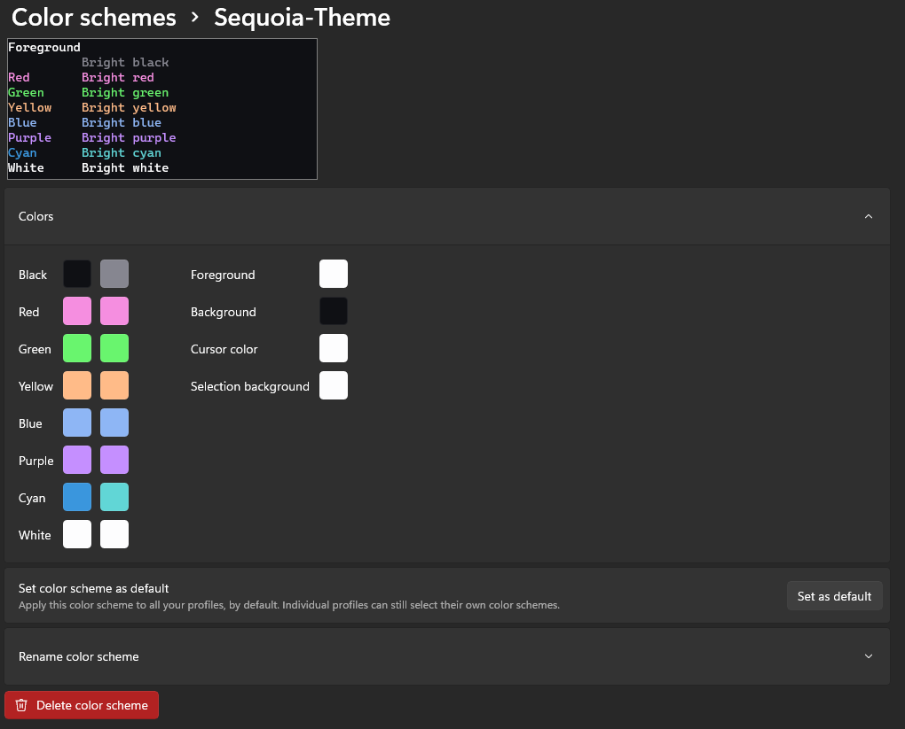

# Sequoia for Windows Terminal
Sequoia theme adapted to Windows Terminal

# Instructions

Check out the [Windows Terminal Docs](https://docs.microsoft.com/en-us/windows/terminal/custom-terminal-gallery/custom-schemes) to learn how to install custom color schemes.

Here's the gist:

1. Open the [`schemes.json`](./config.json) file inside this repository
   - This file is a small part of the Windows Termial Settings file and includes only the three theme variants
2. Copy the three theme variants to the `schemes`-array inside your Windows Terminal settings file (`settings.json`)
   - You can find the file by opening your terminal and pressing `CTRL` + `SHIFT` + `,`

### Tips

- After installing the themes, you'll have to update your profiles in order to use them. Go to settings, choose your profile on the left, click the `Appearance` tab and select the new color scheme.  
  You can also change your "Defaults"-profile in case you haven't overwritten it with your profiles.

# Available themes:

Moonlight:

## Screenshots

### Moonlight


```json
{
   "background":"#0F1014",
   "black":"#0F1014",
   "blue":"#8EB6F5",
   "brightBlack":"#868690",
   "brightBlue":"#8EB6F5",
   "brightCyan":"#61D6D6",
   "brightGreen":"#69F56E",
   "brightPurple":"#C58FFF",
   "brightRed":"#F58EE0",
   "brightWhite":"#FDFDFE",
   "brightYellow":"#FFBB88",
   "cursorColor":"#FDFDFE",
   "cyan":"#3A96DD",
   "foreground":"#FDFDFE",
   "green":"#69F56E",
   "name":"Sequoia-Theme",
   "purple":"#C58FFF",
   "red":"#F58EE0",
   "selectionBackground":"#FDFDFE",
   "white":"#FDFDFE",
   "yellow":"#FFBB88"
}
```

#

Sequoia Theme created by [Micheal Andreuzza](https://github.com/michael-andreuzza) and ported by [birobirobiro](https://birobirobiro.dev/).
